# THE RISING OF THE SHIELD HERO PROJECT 🛡️👑🗡️

Welcome otakus! This repository hosts the development of a website dedicated to this exciting anime. Here, we present a detailed description of the main sections it contains.

## 📚 Index
<ul>
  <li><a href="#introduction">Introduction</a></li>
  <li><a href="#motivation">Motivation</a></li>
  <li><a href="#structure">Structure</a></li>
  <li><a href="#style">Style</a></li>
  <li><a href="#snippets">Code snippets</a></li>
</ul>

<h2 id="introduction">🌟 Introduction</h2>

Project done by: Eloy Leiva López

Free theme web project for the 2nd evaluation of Markup Languages

February 2024

<h2 id="motivation">🔥 Motivation</h2>

I have chosen the topic about The Rising of The Shield Hero because I really like anime in general ad I want to rewatch this one.

<h2 id="structure">🏗️ Structure</h2>

The website is divided into 7 sections:

🚀 1. Hero Section

📖 2. Synopsis

👤 3. Characters

⚔️ 4. Best Moments

🖼️ 5. Gallery

☎️ 6. Contact

👣 7. Footer

<h3>🚀 1. Hero Section</h3>
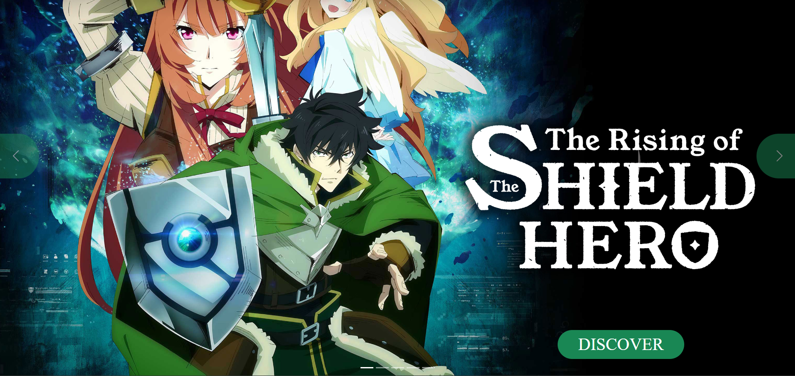
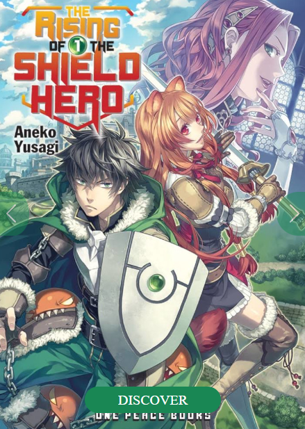

I have used a carousel of wallpapers of The Shield Hero on PC and Tablet and light novel covers on mobile. Above it I have placed a Call to Action that directs us to the Synopsis section.

<h3>📖 2. Synopsis</h3>
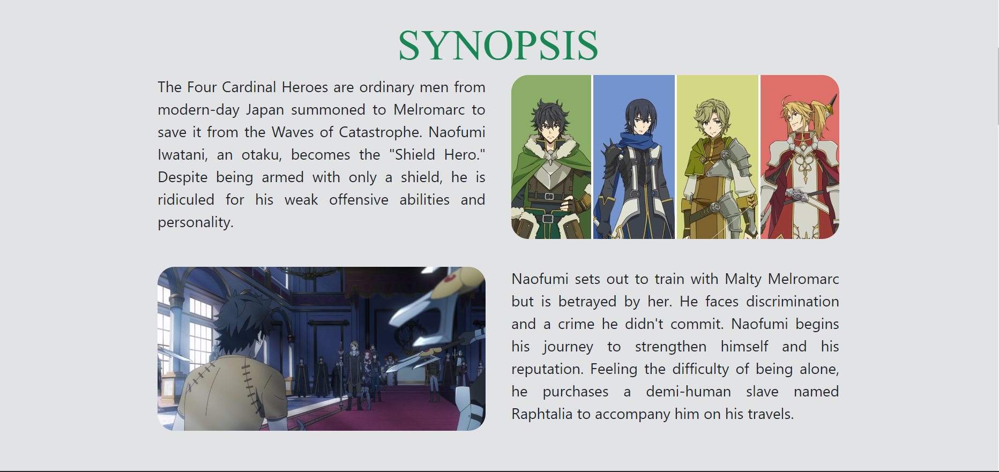
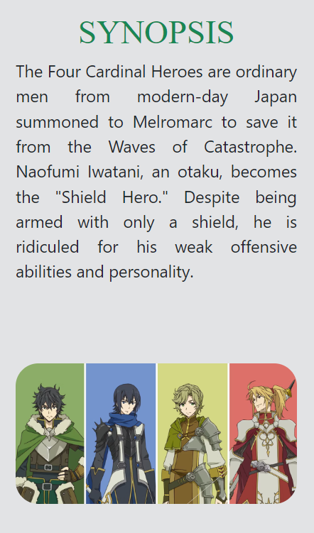

The Synopsis section provides a complete and concise narrative of the storyline. From The Shield Hero beginnings to even the explanation of how he got betrayed, this section will be the essential guide for newcomers and a refreshing review for veterans.

<h3>👤 3. Characters</h3>
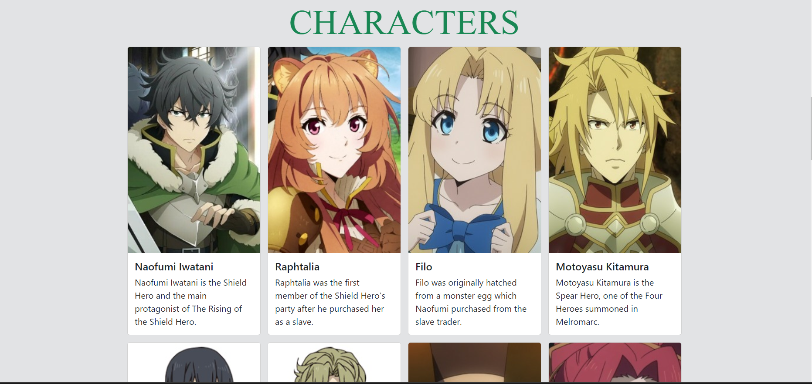
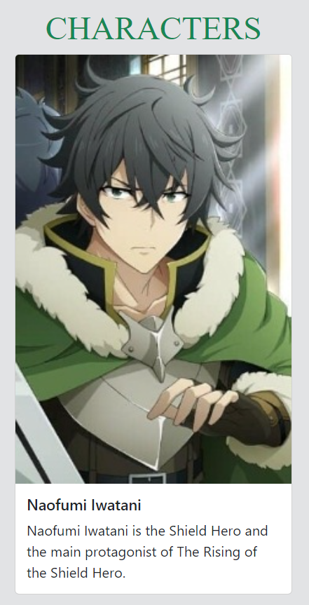

Discover more about the fascinating characters that bring The Rising of The Shield Hero to life. Each profile will provide a short information about the character.

<h3>⚔️ 4. Best Moments</h3>
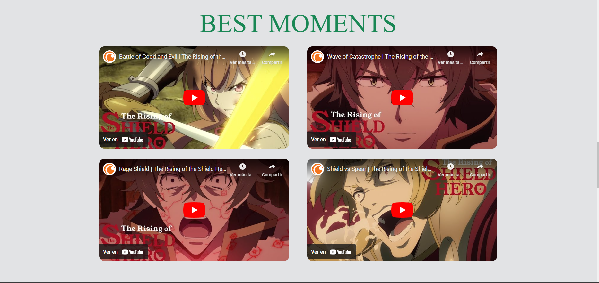
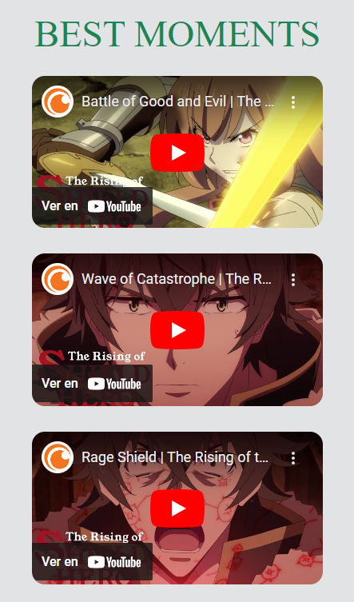

The Best Moments section will highlight the most epic showdowns and moments in The Rising of the Shield Hero. From The Shield Hero fights to most memorable moments.

<h3>🖼️ 5. Gallery</h3>
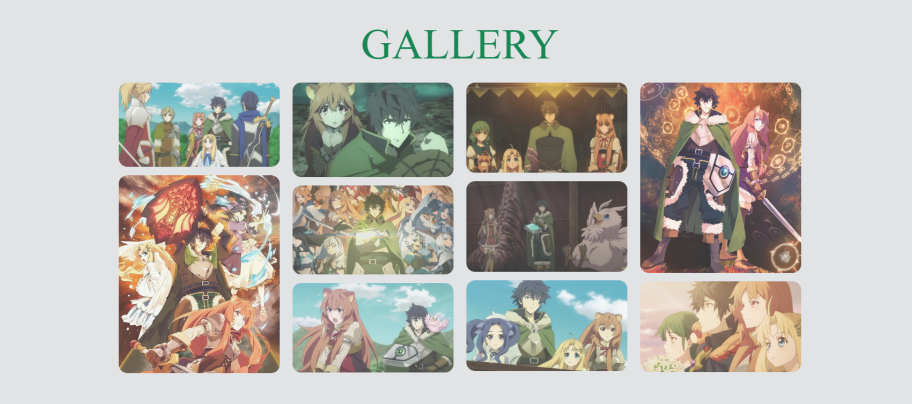
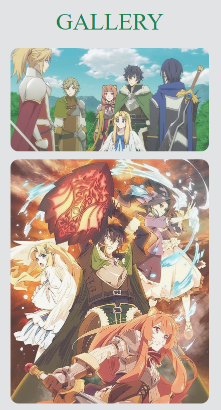

Explore the rich collection of images and artwork from The Rising of The Shield Hero in the Gallery. From covers to anime moments, this section is a visual feast for fans.

<h3>☎️ 6. Contact</h3>
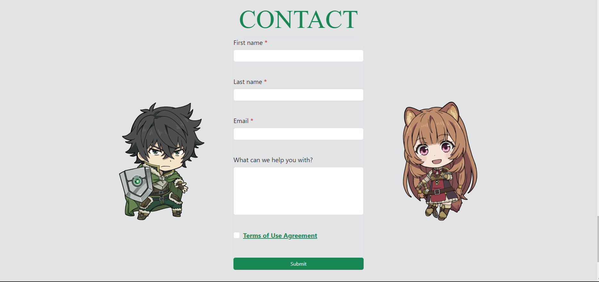
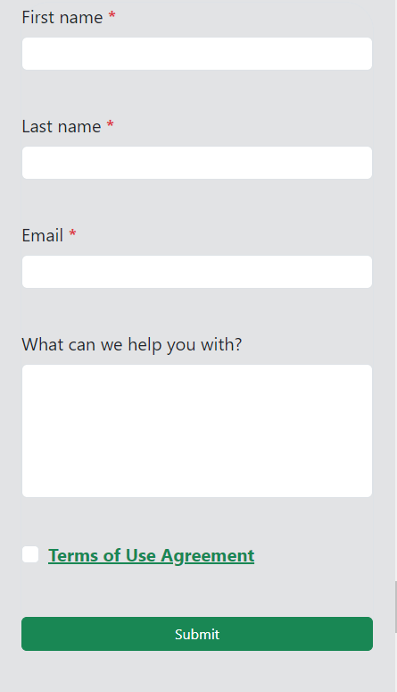

Check this section to contact us or just to ckeck the terms of use of this webpage.

<h3>👣 7. Footer</h3>

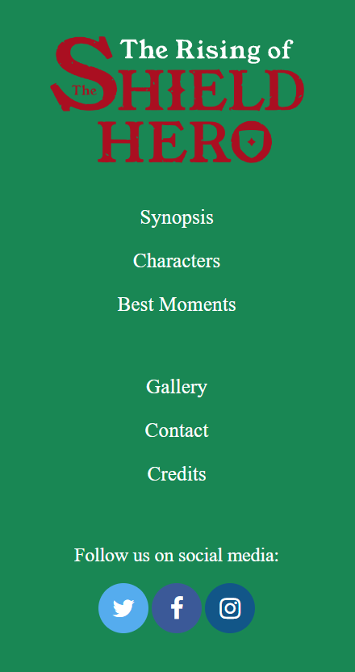

Follow the official The Rising of The Shield Hero social networks so you don't miss the last detail. From here you can access to the credits.

<h2 id="style">Style</h2>
<h3>🎨 Color palette</h3>
<ul>
  <li>60% ⚪</li>
  <li>30% 🟢</li>
  <li>10% 🔴</li>
</ul>

<h3>🖋️ Fonts</h3>
<ul>
  <li>Titles: Times New Roman</li>
  <li>Text: Default from Bootstrap</li>
</ul>

<h3>📷 Images</h3>

All images have been taken from Internet (You can check the Credits on the footer for know the origin of the images used).

<h3>🎥 Videos</h3>
All videos have been taken from YouTube.

<h2 id="snippets"> 💻Code snippets</h2>
<ul>
  <li>Navbar: <a href="https://getbootstrap.com/docs/5.3/components/navbar/#nav">From Bootstrap "Navbar"</a></li>
  <li>Slideshow: <a href="https://getbootstrap.com/docs/5.3/components/carousel/">From Bootstrap "Carousel"</a></li>
  <li>Cards: <a href="https://getbootstrap.com/docs/5.3/components/card/">From Bootstrap "Cards"</a></li>
  <li>Form: <a href="https://getbootstrap.com/docs/5.3/forms/form-control/">From Bootstrap "Form controls"</a></li>
</ul>

We hope you enjoy exploring this The Rising of The Shield Hero website!🛡️🗡️

© *This is a non-profit student project. You can check the "Credits" on the footer for know the origin of the images used.* ©
